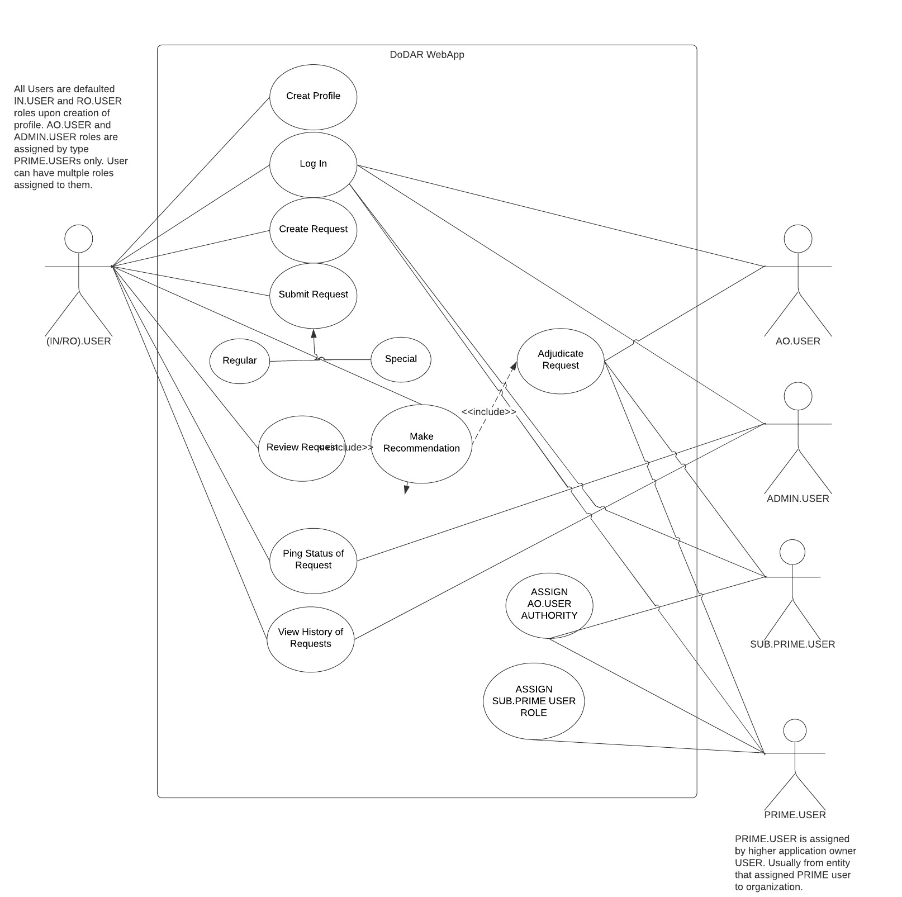
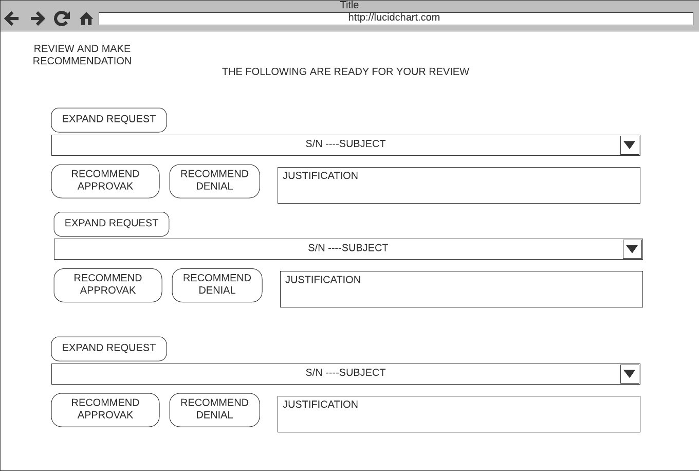

# Department of Defense Automated-Routing (DoDAR)

## Table of Contents
- [DoD Automated-Routing Concept Description](https://github.com/johnathancurtis/DoD-AutoRoute/blob/main/README.md#dod-automated-routing-concept-description)
- [Entity Relationship Diagram (ERD)](https://github.com/johnathancurtis/DoD-AutoRoute/blob/main/README.md#dodar-erd)
- [User Stories](https://github.com/johnathancurtis/DoD-AutoRoute/blob/main/README.md#User-Stories)
- [Use Cases](https://github.com/johnathancurtis/DoD-AutoRoute/blob/main/README.md#use-cases)
- [Requirements Table](https://github.com/johnathancurtis/DoD-AutoRoute/blob/main/README.md#requirements-table)
- [Test Table](https://github.com/johnathancurtis/DoD-AutoRoute/blob/main/README.md#test-table)
- [DoDAR Draft Wireframes](https://github.com/johnathancurtis/DoD-AutoRoute/blob/main/README.md#dodar-draft-wireframes)
- [DoDAR Database Schema](https://github.com/johnathancurtis/DoD-AutoRoute/blob/main/README.md#database-schema)

## DoD Automated-Routing Concept Description:

As a military Administrative professional, there are certain documents that are standard and widely used accross the Department of Defense. Unfortunately, each branch of the military likes to process things a little differently from others, which makes the process slower and has the potential to impact service members greatly and often unintentionally. This web application is a bridge that simplifies the most standard and widely used types of correspondence that requires quick review and signature from superiors. The DoD Automated Router web application will allow service members to generate standardized forms anywhere and from the convenience of there phone or PC/MAC and automatically route through default or manual built, chain of command reviewers and approvers. It will greatly reduce turnaround time, increase tracking and tracing of individual submissions, and greatly reduce cumbersome administrative office workloads. By making a user friendly application that generates documents, the service member can quickly create a document without having to waste valuable time researching how to submit a document properly and focus on the job they were trained to do, and also allowing adminsrative departments to focus efforts on more complicated taskers. 

[Back to Table of Contents](https://github.com/johnathancurtis/DoD-AutoRoute/blob/main/README.md#table-of-contents)

## DoDAR ERD
 

[Back to Table of Contents](https://github.com/johnathancurtis/DoD-AutoRoute/blob/main/README.md#table-of-contents)

## User Stories
#### [All Service Members]
- As a service member, I would like an application that would allow me to create a profile that would have the ability to transfer from command to command when I transfer from command to command so that I do not have to fill out the same paperwork over and over upon checking in/out of my current command.
- As a service member, I would like an application that will allow me to use a digital signature for all my standard correspondence submitted digitally.
- As a service member, I would like an application that stored all my basic data and current chain of command as defaulted information when I generate correspondence for routing, so that I do not have to fill out the information over and over.
#### [Initiator]
- As an initiating service member, I want an application that will allow me to generate standard regular correspondence and submit it to my chain-of-command for review and approval digitally and from anywhere, so that I can spend more time on the mission and less time in the office.
 -As an initiating service member, I would like my submitted correspondence to automatically continue to the next review/approver assigned upon the prior reviewer’s signature, so that I do not have to worry about my request getting lost.
- As an initiating service member, I want an application that will allow me to generate special requests with specific reviewers and approvers of my choice to submit digitally, so that I will be able to make special request for unordinary requests. 
- As an initiating service member, I want my regular correspondence to be submitted with all my common information and chain-of-command already filled out for me, so that I do not have to do every time a generate a request and submit it quickly.
- As an initiating service member, I want to be able to quickly check the status of my submitted digital documents, so that I do not have to talk to the administration personnel every time I need a status. 
- As an initiating service member, I would like to send a reminder to the person reviewing or approving my correspondence to do so soon, so that I do not have to physically find that person and remind them.
- As an initiating service member, I would like to see all the correspondence I have submitted and a copy of all my adjudicated correspondence, so that I can reference and analyze them and have for my records.
#### [Reviewer]
- As a reviewing service member, I would like the ability to review documents assigned to me for review and recommendation digitally, so that I can review correspondence from anywhere quickly.
- As a reviewing service member, I would like a text block next to my recommendation so that I can explain the reasoning of my recommendation if I choose.
- As a reviewing service member, I would like to see all the correspondence assigned to me for review in one list, so that I do not have to look for correspondence individually. 
- As an approving service member, I would like the ability to adjudicate documents assigned to me for adjudication digitally, so that I can adjudicate correspondence from anywhere quickly.
#### [Approver]
- As an approving service member, I would like a text block next to my adjudication decision so that I can explain the reasoning of my adjudication if I choose.
- As an approving service member, I would like to see all the correspondence assigned to me for adjudication in one list, so that I do not have to look for correspondence assigned to me individually.
#### [Administration]
- As an Admin service member, I would like an application that would let me generate reports on submitted correspondence digitally, so that I can analyze the reports and - - identify constraints in administrative practices.
- As an Admin service member, I would like to view all the personnel assigned to the command and be able to see their current chain of command, their POCs, and history of correspondence submitted digitally, so that I can monitor pending correspondence adjudication, and quickly contact personnel. 
- As an Admin service member, I would like an application that will allow me to assign documents to anyone person or group of people in the command for review and signature and assign a due date, so that I can complete tasks that require command cognizance quickly. 
- As an Admin service member, I would like an application that can generate and process regular correspondence digitally, so that I do not have to generate them physically and risk carbon copies loss, damage, corrections and wasted time. 
#### [Prime-Types]
- As a prime-type service member, I would like an application that allowed me to assign the authority of approving users, so that I can maintain control of who has the authority to grant request in my command. 
#### [Prime]
- As the prime service member of a command, I would like the ability to assign other prime type users so that I can delegate my duties as a prime user and free up my time to focus on organizational goals. 
 
[Back to Table of Contents](https://github.com/johnathancurtis/DoD-AutoRoute/blob/main/README.md#table-of-contents)

## Use Cases

1. Given that a user has already set up there profile, when they want to generate a new piece of correspondence for submission, then the user can generate a document without having to fill out profile information and submit the document which will route to everyone listed in the members profile chain-of-command.

2. Given when the Initiating user (IN.User) has submitted correspondence for routing, and when a Reviewing Official user (RO.user) has not reviewed the submission after a period of time, then the IN.User can ping the current RO.User with a friendly reminder to review the document.
 
3. Given when the IN.User has already submitted correspondence for routing, when IN.User has the time, then the IN.User can check the status of all submitted correspondence.
 
4. Given when IN.User has submitted correspondence, when IN.User wants to see all correspondence currently in progress, then the IN.user can see a summary of all correspondence in progress to-date.

5. Given a submission assigned to an RO.User, when the RO.User has time, then the RO.User can review a summary of all correspondence assigned  and click to review selected submission. 

6. Given a submission was assigned for adjudication to an Approving Official user (AO.User), when the AO.User finds time, then the AO.User can see a summary of all correspondence assigned and adjudicate selected submission.
 
7. Given that correspondence have been submitted for routing, and when the commanding officer is asking the admin department how many pieces of correspondence have been submitted, then the Admin User (Admin.User) can generate a report to review a summary of all submitted active and complete submissions. 

[Back to Table of Contents](https://github.com/johnathancurtis/DoD-AutoRoute/blob/main/README.md#table-of-contents)

[Back to Table of Contents](https://github.com/johnathancurtis/DoD-AutoRoute/blob/main/README.md#table-of-contents)

## Requirements Table

[Back to Table of Contents](https://github.com/johnathancurtis/DoD-AutoRoute/blob/main/README.md#table-of-contents)

## Test Table

[Back to Table of Contents](https://github.com/johnathancurtis/DoD-AutoRoute/blob/main/README.md#table-of-contents)

## DoDAR Draft Wireframes

[Back to Table of Contents](https://github.com/johnathancurtis/DoD-AutoRoute/blob/main/README.md#table-of-contents)

[DoDAR Preliminary Wireframes](https://github.com/johnathancurtis/DoD-AutoRoute/blob/main/README.md#dodar-preliminary-wireframes)

[Back to Table of Contents](https://github.com/johnathancurtis/DoD-AutoRoute/blob/main/README.md#table-of-contents)

[DoDAR Preliminary Wireframes](https://github.com/johnathancurtis/DoD-AutoRoute/blob/main/README.md#dodar-preliminary-wireframes)

[Back to Table of Contents](https://github.com/johnathancurtis/DoD-AutoRoute/blob/main/README.md#table-of-contents)

[DoDAR Preliminary Wireframes](https://github.com/johnathancurtis/DoD-AutoRoute/blob/main/README.md#dodar-preliminary-wireframes)

[Back to Table of Contents](https://github.com/johnathancurtis/DoD-AutoRoute/blob/main/README.md#table-of-contents)

[DoDAR Preliminary Wireframes](https://github.com/johnathancurtis/DoD-AutoRoute/blob/main/README.md#dodar-preliminary-wireframes)

[Back to Table of Contents](https://github.com/johnathancurtis/DoD-AutoRoute/blob/main/README.md#table-of-contents)

[DoDAR Preliminary Wireframes](https://github.com/johnathancurtis/DoD-AutoRoute/blob/main/README.md#dodar-preliminary-wireframes)

[Back to Table of Contents](https://github.com/johnathancurtis/DoD-AutoRoute/blob/main/README.md#table-of-contents)

[DoDAR Preliminary Wireframes](https://github.com/johnathancurtis/DoD-AutoRoute/blob/main/README.md#dodar-preliminary-wireframes)

[Back to Table of Contents](https://github.com/johnathancurtis/DoD-AutoRoute/blob/main/README.md#table-of-contents)

[DoDAR Preliminary Wireframes](https://github.com/johnathancurtis/DoD-AutoRoute/blob/main/README.md#dodar-preliminary-wireframes)

## Database Schema

[Back to Table of Contents](https://github.com/johnathancurtis/DoD-AutoRoute/blob/main/README.md#table-of-contents)
