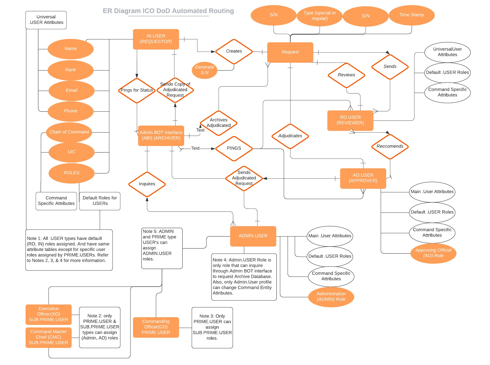

# DODAR

## Table of Contents
- [Description](https://github.com/johnathancurtis/DoD-AutoRoute/blob/main/README.md#dod-automated-routing-description)
- [ Entity Relationship Diagram (ERD)](https://github.com/johnathancurtis/DoD-AutoRoute/blob/main/README.md#dodar-erd)

  

### DoD Automated-Routing Description:

As a military Administrative professional, there are certain documents that are standard and widely used accross the Department of Defense. Unfortunately, each branch of the military likes to process things a little differently from others, which makes the process slower and has the potential to impact service members greatly and often unintentionally. This web application is a bridge that simplifies the most standard and widely used types of correspondence that requires quick review and signature from superiors. The DoD Automated Router web application will allow service members to generate standardized forms anywhere and from the convenience of there phone or PC/MAC and automatically route through default or manual built, chain of command reviewers and approvers. It will greatly reduce turnaround time, increase tracking and tracing of individual submissions, and greatly reduce cumbersome administrative office workloads. By making a user friendly application that generates documents, the service member can quickly create a document without having to waste valuable time researching how to submit a document properly and focus on the job they were trained to do, and also allowing adminsrative departments to focus efforts on more complicated taskers. 

[Table of Contents](https://github.com/johnathancurtis/DoD-AutoRoute/blob/main/README.md#table-of-contents)

### [DODAR ERD]
 

[Table of Contents](https://github.com/johnathancurtis/DoD-AutoRoute/blob/main/README.md#table-of-contents)
